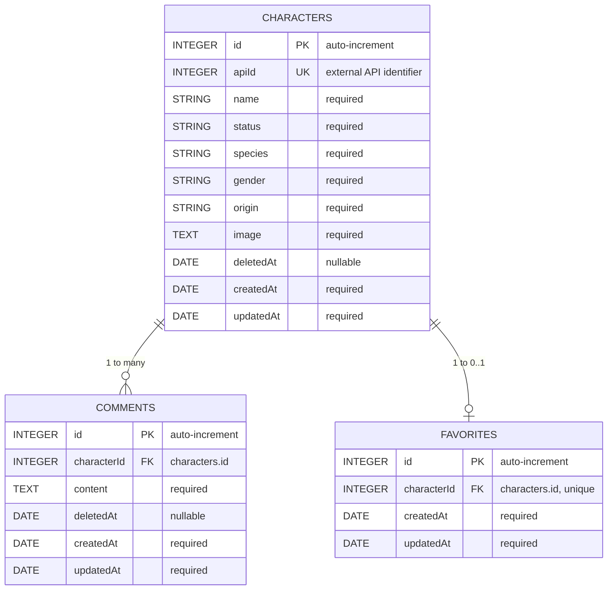

# ERD diagram V2

## Related documentation

- Main overview and setup: [../README.md](../README.md)
- Architecture and data flow: [ARCHITECTURE.md](ARCHITECTURE.md)
- Docker environment: [DOCKER.md](DOCKER.md)
- GraphQL contract: [GRAPHQL_API.md](GRAPHQL_API.md)

---

## Overview

This is the relational model used by the application persistence layer.

### Main entities
- characters: canonical character data
- comments: user comments linked to one character
- favorites: favorite state linked to one character

### Key behavior
- soft delete is handled with deletedAt in characters and comments
- one character can have many comments
- one character can have at most one favorite row

---

## ERD V2

---

## Detailed table definition

### characters

| Column | Type | Key / Rule | Detail |
|---|---|---|---|
| id | INTEGER | PK, auto-increment | Internal primary identifier |
| apiId | INTEGER | UNIQUE, NOT NULL | Source id from the Rick and Morty API |
| name | STRING | NOT NULL | Character display name |
| status | STRING | NOT NULL | Alive, Dead, Unknown |
| species | STRING | NOT NULL | Species label |
| gender | STRING | NOT NULL | Gender label |
| origin | STRING | NOT NULL | Origin name |
| image | TEXT | NOT NULL | Avatar URL |
| deletedAt | DATE | NULL | Soft delete marker |
| createdAt | DATE | NOT NULL | Creation timestamp |
| updatedAt | DATE | NOT NULL | Update timestamp |

### comments

| Column | Type | Key / Rule | Detail |
|---|---|---|---|
| id | INTEGER | PK, auto-increment | Comment identifier |
| characterId | INTEGER | FK, NOT NULL | References characters.id |
| content | TEXT | NOT NULL | Comment content |
| deletedAt | DATE | NULL | Soft delete marker |
| createdAt | DATE | NOT NULL | Creation timestamp |
| updatedAt | DATE | NOT NULL | Update timestamp |

### favorites

| Column | Type | Key / Rule | Detail |
|---|---|---|---|
| id | INTEGER | PK, auto-increment | Favorite identifier |
| characterId | INTEGER | FK, UNIQUE, NOT NULL | References characters.id and prevents duplicate favorites |
| createdAt | DATE | NOT NULL | Creation timestamp |
| updatedAt | DATE | NOT NULL | Update timestamp |

---

## Relationship and integrity rules

- comments.characterId has cascade update and cascade delete
- favorites.characterId has cascade update and cascade delete
- favorites.characterId is unique, so a character cannot be favorited more than once in the table
- deletedAt allows logical deletion without physically removing the row immediately
